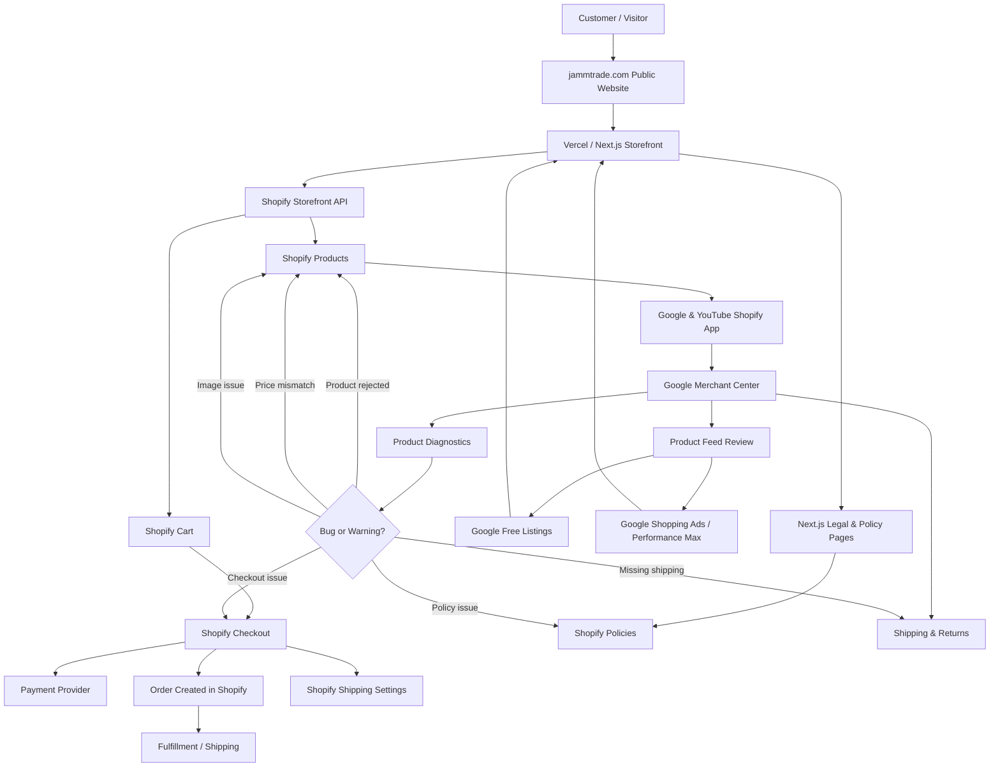

# Jamm Trade - Architecture & Bug Diagnosis Map

A plain-language guide to how all the pieces of Jamm Trade connect, and where
to look when something goes wrong.

## Intended Setup

Jamm Trade is a headless commerce site:

- **Vercel/Next.js is the public storefront.** Customers browse the homepage,
  shop, collection pages, product pages, cart UI, legal pages, and SEO content
  on the Jamm Trade website.
- **Shopify is the backend commerce system.** Shopify owns products, variants,
  stock, policies, shipping settings, payments, orders, and secure checkout.
- **Shopify checkout is the only customer-facing Shopify step.** The Next.js
  app creates a Shopify cart through the Storefront API, then redirects the
  customer to the returned Shopify checkout URL.
- **Keep the Shopify theme as a no-index fallback.** Preview theme updates as
  unpublished, then publish only the reviewed fallback for `shop.jammtrade.com`.
  The Next.js storefront remains canonical.

---

## How Everything Is Connected

---

## Bug Diagnosis Map

Use this table when something breaks. Find the symptom on the left, then go fix
it in the right place.

### Homepage Or Website Design Looks Broken

**Where to look:** The custom frontend - files inside this repository
(`/app`, `/components`, `/styles`).

Shopify has nothing to do with the website design. If a layout, font, color, or
section looks wrong, the fix is in the Next.js code, not in Shopify Admin.

### Product Name, Price, Description, Or Image Is Wrong On The Website

**Where to look:** Shopify Admin -> **Products**.

The website reads product data live from Shopify. If the data is wrong on the
site, fix it in Shopify and it will update automatically within a few minutes.

### Checkout Is Not Working

**Where to look - check all of these:**

1. **Shopify Admin -> Settings -> Payments** - is the payment provider active
   and configured?
2. **Shopify Admin -> Settings -> Shipping and delivery** - are shipping rates
   set up for your region?
3. **Vercel environment variables** - are `SHOPIFY_STORE_DOMAIN` and
   `SHOPIFY_STOREFRONT_ACCESS_TOKEN` set?
4. **Domain settings** - is the public website domain still pointing to Vercel,
   with only checkout handled by Shopify?
5. **Shopify Status page** - Shopify sometimes has outages that affect checkout.

### Google Products Are Limited, Disapproved, Or Not Showing

**Where to look:** Google Merchant Center -> **Products -> Diagnostics**.

Merchant Center will show you exactly which products have issues and why.
Common reasons:

- Missing required fields such as price, availability, or GTIN.
- Policy violations such as misleading title or restricted category.
- Images that do not meet Google's requirements.
- Website policies not found, such as privacy policy, return policy, or
  shipping policy.

### Shipping Issue Appears In Google Merchant Center

**Where to look - check both sides:**

1. **Google Merchant Center -> Shipping and returns** - make sure a shipping
   service is configured and the return policy URL points to the Next.js site.
2. **Shopify Admin -> Settings -> Shipping and delivery** - make sure shipping
   rates exist for the countries you sell to.

### Product Image Is Missing Or Rejected

**Where to look - check in order:**

1. **Shopify Admin -> Products -> [product] -> Media** - is a high-quality image
   uploaded? Google requires images to be at least 100x100 px, preferably
   800x800 px or larger.
2. **Google Merchant Center -> Products -> Diagnostics** - look for image
   related errors on that specific product.
3. **Google & YouTube app in Shopify** - trigger a manual sync if the image was
   recently updated.

### Traffic Is Low Or Products Are Not Being Found

**Where to look - check these in order:**

1. **Google Merchant Center -> Products** - are products approved and active?
2. **Google Search Console** - check crawl errors or manual actions for the
   public Vercel/Next.js domain.
3. **Product titles and descriptions in Shopify** - use clear, descriptive
   titles that match what people search for.
4. **Google Ads** - check that campaigns are active and budgets are not
   exhausted.
5. **SEO basics** - make sure product pages have meta titles, descriptions, and
   canonical URLs on the Next.js site.

### Product Price In Google Shopping Does Not Match Shopify

**Where to look:**

1. **Shopify Admin -> Products -> [product]** - confirm the correct price is
   saved there.
2. **Google & YouTube app in Shopify** - trigger a manual sync. Price updates
   from Shopify can take up to 24 hours to appear in Google.
3. **Google Merchant Center -> Products -> [product]** - check the price field
   in the product detail view.

Google compares the feed price to the price visible on the public product page.
Always update prices in Shopify so the feed and Next.js product page match.

---

## Quick Reference

| Symptom | Fix location |
|---|---|
| Website design broken | This repo - `/app` or `/components` |
| Wrong product data on site | Shopify Admin -> Products |
| Checkout not working | Shopify env vars, payments, shipping, domain, Shopify status |
| Products limited/disapproved | Merchant Center -> Diagnostics |
| Shipping issue in Google | Merchant Center shipping + Shopify shipping rates |
| Product image missing | Shopify media -> re-sync via Google & YouTube app |
| Low traffic | Merchant Center approvals, Search Console, SEO, Ads |
| Price mismatch | Update in Shopify -> wait for feed sync |
